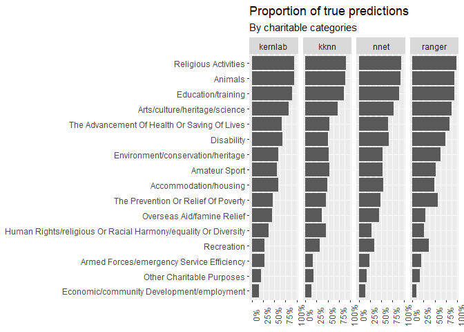
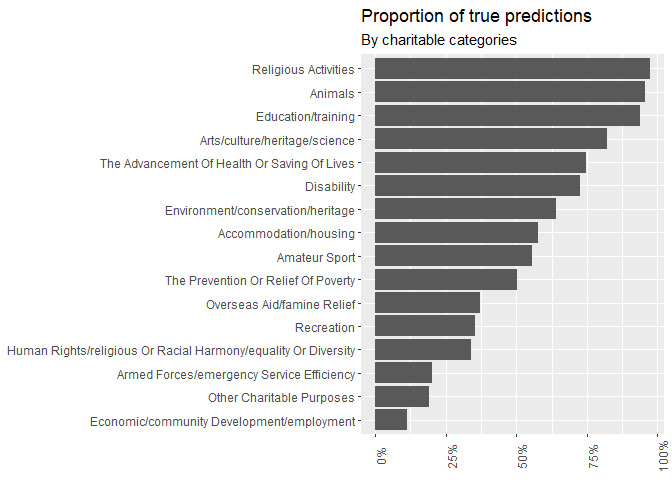

Charity commission data classification
================
Claire Benard

Aim of this notebook: classifying charities based on their object.

Final product: maybe a shiny app that, given a charitable object returns
the proability of each class?

# Set up

``` r
library(tidyverse)
```

    ## -- Attaching packages --------------------------------------- tidyverse 1.3.1 --

    ## v ggplot2 3.3.5     v purrr   0.3.4
    ## v tibble  3.1.5     v dplyr   1.0.7
    ## v tidyr   1.1.4     v stringr 1.4.0
    ## v readr   2.1.1     v forcats 0.5.1

    ## Warning: package 'readr' was built under R version 4.1.2

    ## -- Conflicts ------------------------------------------ tidyverse_conflicts() --
    ## x dplyr::filter() masks stats::filter()
    ## x dplyr::lag()    masks stats::lag()

``` r
library(textrecipes)
```

    ## Warning: package 'textrecipes' was built under R version 4.1.2

    ## Loading required package: recipes

    ## Warning: package 'recipes' was built under R version 4.1.2

    ## 
    ## Attaching package: 'recipes'

    ## The following object is masked from 'package:stringr':
    ## 
    ##     fixed

    ## The following object is masked from 'package:stats':
    ## 
    ##     step

``` r
library(tidymodels)
```

    ## Warning: package 'tidymodels' was built under R version 4.1.2

    ## Registered S3 method overwritten by 'tune':
    ##   method                   from   
    ##   required_pkgs.model_spec parsnip

    ## -- Attaching packages -------------------------------------- tidymodels 0.1.4 --

    ## v broom        0.7.11     v rsample      0.1.1 
    ## v dials        0.0.10     v tune         0.1.6 
    ## v infer        1.0.0      v workflows    0.2.4 
    ## v modeldata    0.1.1      v workflowsets 0.1.0 
    ## v parsnip      0.1.7      v yardstick    0.0.9

    ## Warning: package 'broom' was built under R version 4.1.2

    ## Warning: package 'dials' was built under R version 4.1.2

    ## Warning: package 'infer' was built under R version 4.1.2

    ## Warning: package 'modeldata' was built under R version 4.1.2

    ## Warning: package 'parsnip' was built under R version 4.1.2

    ## Warning: package 'rsample' was built under R version 4.1.2

    ## Warning: package 'tune' was built under R version 4.1.2

    ## Warning: package 'workflows' was built under R version 4.1.2

    ## Warning: package 'workflowsets' was built under R version 4.1.2

    ## Warning: package 'yardstick' was built under R version 4.1.2

    ## -- Conflicts ----------------------------------------- tidymodels_conflicts() --
    ## x scales::discard() masks purrr::discard()
    ## x dplyr::filter()   masks stats::filter()
    ## x recipes::fixed()  masks stringr::fixed()
    ## x dplyr::lag()      masks stats::lag()
    ## x yardstick::spec() masks readr::spec()
    ## x recipes::step()   masks stats::step()
    ## * Dig deeper into tidy modeling with R at https://www.tmwr.org

``` r
data_path <- paste0(here::here(), "/data/")
```

``` r
charity_classification <- jsonlite::fromJSON(paste0(data_path, "publicextract.charity_classification.json"))
```

    ## Warning: JSON string contains (illegal) UTF8 byte-order-mark!

``` r
governing_doc <- jsonlite::fromJSON(paste0(data_path, "publicextract.charity_governing_document.json"))
```

    ## Warning: JSON string contains (illegal) UTF8 byte-order-mark!

# Clean data

This analysis focusses on service providers only. This means that we
remove organisations that are only grant makers or advocacy
organisations.

In theory, the problem is a multi-class multi-label classification
problem, where each charity can have several of the 16 labels. For the
purpose of this product, I simplify the problem to make it only a
multi-class problem: each charity can have one of the 16 labels.

``` r
service_providers <- charity_classification %>%
  filter(classification_description == "Provides Services") 

classification_clean <- charity_classification %>%
  filter(organisation_number %in% service_providers$organisation_number, # keep only service providers
         classification_type == "What", # keep only sector
         classification_description != "General Charitable Purposes") %>% # removing uninformative type
  select(registered_charity_number, classification_description)

nb_classes <- classification_clean %>% 
  count(registered_charity_number)

classification_clean_one_class <- classification_clean %>% semi_join(nb_classes %>% filter(n == 1), by = "registered_charity_number")
```

``` r
classification_clean %>% 
  count(registered_charity_number) %>% 
  ggplot(aes(n)) + geom_histogram(stat = "count") +
  labs(title = "3 out of 4 charities tick more than one box",
       x = "Number of box ticked",
       y = "Count of charities")
```

    ## Warning: Ignoring unknown parameters: binwidth, bins, pad

<!-- -->

``` r
clean_text <- . %>%
  tolower() %>%
  str_replace_all(., "[:punct:]", " ") %>%
  str_replace_all(., "\\s+", " ") %>%
  trimws()

charitable_objects <- governing_doc %>% select(registered_charity_number, charitable_objects) %>%
  mutate(charitable_objects = clean_text(charitable_objects)) %>%
  group_by(registered_charity_number, charitable_objects) %>%
  summarise_all(first) %>%
  ungroup() %>%
  group_by(registered_charity_number) %>%
  summarise(charitable_objects = paste(charitable_objects, collapse = " ")) %>%
  ungroup()
```

``` r
df <- classification_clean_one_class %>% inner_join(charitable_objects, by = 'registered_charity_number')
```

# Build models

## Pre-processing of text

``` r
prep_text_rec <-
  recipe(classification_description ~ charitable_objects + registered_charity_number, data = df) %>%
  # Do not use the charity number in the model
  update_role(registered_charity_number, new_role = "ID") %>%
  # Tokenise text
  step_tokenize(charitable_objects)  %>%
  # Remove stop words
  step_stopwords(charitable_objects) %>%
  # Stem text
  step_stem(charitable_objects) %>%
  # Only keep the most important words
  step_tokenfilter(charitable_objects, max_tokens = 500) %>%  
  # Transform each words by its tf_idf values
  step_tfidf(charitable_objects) %>% 
  # Normalise TFIDF values
  step_normalize(all_numeric())
```

## Train, Test and validation split

``` r
set.seed(123)

data_split <- initial_split(df,
                            strata = classification_description,
                            prop = 0.6)

train_data <- training(data_split)
test_data  <- testing(data_split)

valid_data <- classification_clean %>% 
  semi_join(nb_classes %>% filter(n == 2), by = "registered_charity_number") %>%
  inner_join(charitable_objects, by = "registered_charity_number")
```

## Evaluating different models

``` r
exec_wf <- function(this_model){
  wf <- workflow() %>%
  add_recipe(prep_text_rec) %>%
  add_model(this_model)

  print(paste(Sys.time(), "Starting the fit"))
  
  this_model_fit <- wf %>%
  fit(data = train_data)
  
  return(this_model_fit)
  
}

generate_model_results <- function(this_model){
  
  engine <- this_model$engine
  
  print(paste(Sys.time(), "Building and execute workflow for", engine))
  model_fit <- exec_wf(this_model)
  
  print(paste0("save model ", this_model))
  saveRDS(model_fit, paste0(here::here(), "/models", "/model_", engine, ".rds"))

  print(paste(Sys.time(), "Making predictions..."))
  predictions <- predict(model_fit, test_data) %>%
    bind_cols(test_data %>%
                select(registered_charity_number, classification_description) %>%
                mutate(model_name = engine))
  
  return(predictions)
}
```

``` r
mnr <- multinom_reg() %>%
  set_engine("nnet", MaxNWts = 10000)

rf <- rand_forest(
  mode = "classification",
  engine = "ranger",
  mtry = NULL,
  trees = NULL,
  min_n = NULL
)

knn <- nearest_neighbor(
  mode = "classification",
  engine = "kknn",
  neighbors = 10,
  weight_func = NULL,
  dist_power = NULL
)

svm <- svm_poly(
  mode = "classification",
  engine = "kernlab",
  cost = NULL,
  degree = NULL,
  scale_factor = NULL,
  margin = NULL
)
```

``` r
model_list <- list(mnr, rf, knn, svm)

eval_df <- model_list %>%
  map_dfr(generate_model_results)
```

    ## [1] "2022-03-25 12:07:23 Building and execute workflow for nnet"
    ## [1] "2022-03-25 12:07:23 Starting the fit"
    ## [1] "save model list(penalty = ~NULL, mixture = ~NULL)"
    ## [2] "save model list(MaxNWts = ~10000)"                
    ## [3] "save model classification"                        
    ## [4] "save model NULL"                                  
    ## [5] "save model nnet"                                  
    ## [1] "2022-03-25 12:15:43 Making predictions..."
    ## [1] "2022-03-25 12:15:45 Building and execute workflow for ranger"
    ## [1] "2022-03-25 12:15:45 Starting the fit"
    ## [1] "save model list(mtry = ~NULL, trees = ~NULL, min_n = ~NULL)"
    ## [2] "save model NULL"                                            
    ## [3] "save model classification"                                  
    ## [4] "save model NULL"                                            
    ## [5] "save model ranger"                                          
    ## [1] "2022-03-25 12:18:14 Making predictions..."
    ## [1] "2022-03-25 12:18:21 Building and execute workflow for kknn"
    ## [1] "2022-03-25 12:18:21 Starting the fit"
    ## [1] "save model list(neighbors = ~10, weight_func = ~NULL, dist_power = ~NULL)"
    ## [2] "save model NULL"                                                          
    ## [3] "save model classification"                                                
    ## [4] "save model NULL"                                                          
    ## [5] "save model kknn"                                                          
    ## [1] "2022-03-25 12:27:46 Making predictions..."
    ## [1] "2022-03-25 12:33:52 Building and execute workflow for kernlab"
    ## [1] "2022-03-25 12:33:52 Starting the fit"
    ##  Setting default kernel parameters  
    ## [1] "save model list(cost = ~NULL, degree = ~NULL, scale_factor = ~NULL, margin = ~NULL)"
    ## [2] "save model NULL"                                                                    
    ## [3] "save model classification"                                                          
    ## [4] "save model NULL"                                                                    
    ## [5] "save model kernlab"                                                                 
    ## [1] "2022-03-25 12:58:58 Making predictions..."

!! ONLY RUN IF YOU ALREADY HAVE TRAINED MODELS !!

``` r
eval_df %>%
  group_by(model_name) %>%
  accuracy(as.factor(classification_description), .pred_class)
```

    ## # A tibble: 4 x 4
    ##   model_name .metric  .estimator .estimate
    ##   <chr>      <chr>    <chr>          <dbl>
    ## 1 kernlab    accuracy multiclass     0.802
    ## 2 kknn       accuracy multiclass     0.739
    ## 3 nnet       accuracy multiclass     0.786
    ## 4 ranger     accuracy multiclass     0.839

``` r
eval_df %>%
  group_by(classification_description, model_name) %>%
  summarise(true_pred_prop = mean(classification_description == .pred_class)) %>%
  ggplot(aes(x = reorder(classification_description, true_pred_prop), 
             y = true_pred_prop)) + 
  geom_bar(stat = "identity") +
  scale_y_continuous(labels = percent) +
  theme(axis.text.x = element_text(angle = 90)) +
  coord_flip() +
    facet_grid(. ~  model_name) +
  labs(title = "Proportion of true predictions",
       subtitle = "By charitable categories",
       x = NULL,
       y = NULL)
```

    ## `summarise()` has grouped output by 'classification_description'. You can override using the `.groups` argument.

<!-- -->

``` r
eval_df %>% count(registered_charity_number, .pred_class)
```

    ## # A tibble: 20,766 x 3
    ##    registered_charity_number .pred_class                   n
    ##                        <int> <fct>                     <int>
    ##  1                    200320 Disability                    4
    ##  2                    200988 Education/training            1
    ##  3                    200988 Other Charitable Purposes     3
    ##  4                    201355 Disability                    4
    ##  5                    201441 Accommodation/housing         1
    ##  6                    201441 Animals                       1
    ##  7                    201441 Religious Activities          2
    ##  8                    201640 Accommodation/housing         1
    ##  9                    201640 Disability                    1
    ## 10                    201640 Education/training            2
    ## # ... with 20,756 more rows

``` r
acc_per_cat <- eval_df %>%
  group_by(classification_description, model_name) %>%
  summarise(accuracy_per_cat = mean(classification_description == .pred_class)) %>%
  ungroup()
```

    ## `summarise()` has grouped output by 'classification_description'. You can override using the `.groups` argument.

``` r
write_csv(acc_per_cat, here::here("./data/accuracy_per_cat.csv"))
```

``` r
vote <- . %>%
  inner_join(acc_per_cat, by = c('.pred_class' = 'classification_description',
                                 'model_name')) %>%
  group_by(registered_charity_number, .pred_class) %>% 
  mutate(votes = n()) %>%
  ungroup() %>%
  group_by(registered_charity_number) %>%
  slice_max(order_by = votes) %>%
  slice_max(order_by = accuracy_per_cat) %>%
  summarise_all(first) %>% # edge case when 2 models have the same accuracy
  ungroup()
  
  
voting <- eval_df %>% 
  vote()
```

``` r
voting %>%
  group_by(classification_description) %>%
  summarise(true_pred_prop = mean(classification_description == .pred_class)) %>%
  ggplot(aes(x = reorder(classification_description, true_pred_prop), 
             y = true_pred_prop)) + 
  geom_bar(stat = "identity") +
  scale_y_continuous(labels = percent) +
  theme(axis.text.x = element_text(angle = 90)) +
  coord_flip() +
  labs(title = "Proportion of true predictions",
       subtitle = "By charitable categories",
       x = NULL,
       y = NULL)
```

<!-- -->

``` r
final_trained_models <- list("kernlab" = NULL, 
                             "kknn" = NULL,
                             "nnet" = NULL,
                             "ranger" = NULL)

for (i in c("kernlab", "kknn", "nnet", "ranger")){
  print(paste0("Loading /model_", i, ".rds at ", Sys.time()))
  final_trained_models[[i]] <- readRDS(paste0(here::here(), "/models/model_", i, ".rds"))
}
```

    ## [1] "Loading /model_kernlab.rds at 2022-03-25 13:01:31"
    ## [1] "Loading /model_kknn.rds at 2022-03-25 13:01:32"
    ## [1] "Loading /model_nnet.rds at 2022-03-25 13:01:34"
    ## [1] "Loading /model_ranger.rds at 2022-03-25 13:01:35"

``` r
predict_wf <- function(this_model, data_to_predict){
  
  engine <- this_model$fit$actions$model$spec$engine
  
  predict(this_model, data_to_predict) %>%
    bind_cols(data_to_predict %>%
                select(registered_charity_number) %>%
                mutate(model_name = engine))
}

voting_wf <- function(data_to_predict){
  
  x <- data_to_predict
  list_to_predict <- list(x, x, x, x) # hacky way to create a DF of DFs

    final_trained_models %>%
    map2_dfr(., list_to_predict, predict_wf) %>%
    vote()
    
} 

results <- voting_wf(valid_data)
```

``` r
eval_validation <- results %>% 
  inner_join(valid_data, by = c("registered_charity_number")) %>%
  mutate(true_pred = .pred_class == classification_description) %>% 
  group_by(registered_charity_number) %>%
  summarise(true_pred = sum(true_pred) > 0) %>%
  ungroup()

eval_validation %>% 
  summarise(accuracy = mean(true_pred))
```

    ## # A tibble: 1 x 1
    ##   accuracy
    ##      <dbl>
    ## 1    0.831

# Testing on fake charity

``` r
results %>% filter(registered_charity_number == 200490)
```

    ## # A tibble: 1 x 5
    ##   registered_charity_number .pred_class model_name accuracy_per_cat votes
    ##                       <int> <chr>       <chr>                 <dbl> <int>
    ## 1                    200490 Disability  ranger                0.730     6

``` r
voting_wf(data.frame(registered_charity_number = 1234,
                     charitable_objects = "to promote the relief of physically disabled people in the county of surrey in such ways as the association shall from time to time determine and in particular by enabling those people to live more independently providing advice information and education providing and supporting opportunities for respite and social activities"))
```

    ## # A tibble: 1 x 5
    ##   registered_charity_number .pred_class model_name accuracy_per_cat votes
    ##                       <dbl> <chr>       <chr>                 <dbl> <int>
    ## 1                      1234 Disability  ranger                0.730     2
